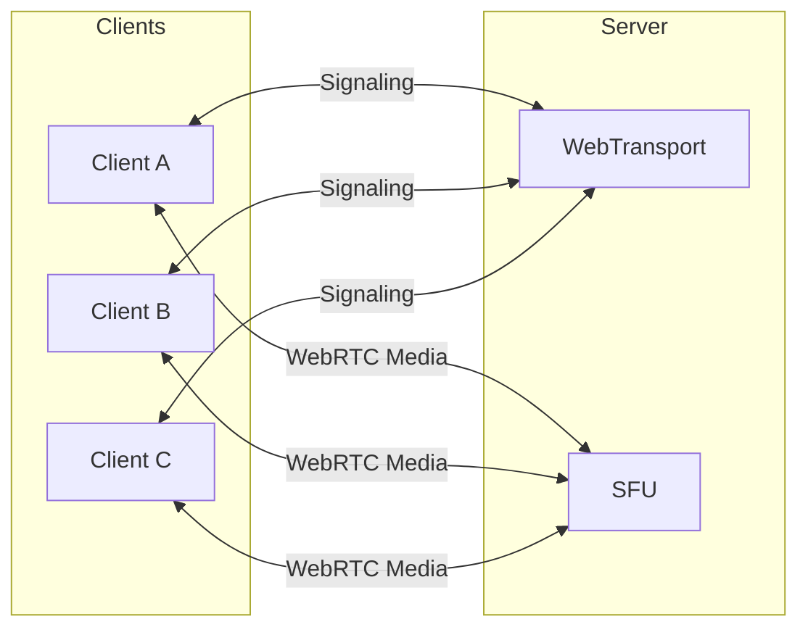

# Project Architecture

## Overview

Peer-Connect follows a client-server architecture centered around a Selective Forwarding Unit (SFU). Each participant establishes a WebRTC connection with the server rather than directly connecting to every other participant. The SFU receives media tracks from each participant and forwards them to the other participants in the room.

WebTransport provides the communication channel between the frontend and backend for signaling and other control messages required to establish and manage WebRTC connections.

The diagram below shows the high-level relationship between the clients and the server.



## Connection Lifecycle

The connection lifecycle shows a typical use case of Peer-Connect and the processes involved throughout a participant's session. A typical session moves through the following phases:
1. The client establishes a WebTransport connection with the server for signaling.
2. The server creates a participant session.
3. The participant creates a room or joins an existing room.
4. The client acquires local audio and video tracks.
5. The client and server negotiate a WebRTC connection through the signaling channel.
6. The participant's media session is activated.
7. The SFU publishes and forwards media tracks between participants.
8. Media changes may trigger additional WebRTC negotiation.
9. When the participant leaves or disconnects, the server removes their room state, tracks, and associated connections.affected subscriptions, and closes their WebRTC session.tracks

## WebTransport (Signaling)

WebTransport is a modern web API that provides signaling between the frontend and backend. It creates low-latency, bidirectional connection over HTTP/3 and QUIC that allows the client and server to exchange messages. 

Peer-Connect uses this connection to exchange application-level messages required to coordinate application functionality, such as creating and managing meeting room sessions. More importantly, it provides the signaling mechanism used to establish and manage WebRTC connections.

WebTransport does not carry the audio and video streams for a call. Instead, it coordinates the WebRTC connection that is responsible for transporting the media.

## Signaling Protocol

Both the frontend and backend contain files that define the signaling protocol. These definitions establish the expected requests, responses, and events, allowing unknown requests and unexpected responses to be handled appropriately.

The protocol definitions are located in [src/protocols](../frontend/src/protocols) on the frontend and [messages.py](../backend/messages.py) on the backend. These files should be treated as reference for the available message types.

Signals use a standard JSON structure. Each signal includes an identifier, either request_id or event_id, which allows multiple signals to be tracked concurrently. A type field identifies the command or event being sent. Depending on the message type, additional fields may be included to provide the required data.

Example JSON message:
```json
{
  "request_id": "123",
  "type": "webrtc-offer",
  "sdp": "string"
}
```

## WebRTC (Media)

Web Real-Time Communication (WebRTC) is an open source technology, providing a collection of APIs and protocols to establish a secure real-time communication between endpoints. In Peer-Connect, WebRTC is responsible for transmitting audio and video between each client and the SFU.

An RTCPeerConnection object is created in the frontend and backend respectively. Before media can flow, the client and server must negotiate the parameters of the connection. This primarily involves exchanging Session Description Protocol (SDP) information through WebTransport.

SDP describes the media session and the capabilities of each endpoint. It includes information such as available audio and video tracks, supported codecs, and other parameters needed for the connection.

Once negotiation and connectivity checks succeed, WebRTC establishes the media connection. The client can then publish its local tracks to the SFU and receive tracks belonging to other participants.

## SFU (Media Router)

The Selective Forwarding Unit (SFU) is responsible for routing media between participants in a room. Each participant establishes a WebRTC connection with the SFU and publishes their local media tracks. The SFU receives these tracks and forwards them to the appropriate participants in the same room. This allows participants to exchange media without establishing direct WebRTC connections with one another.

In Peer-Connect, the SFU is an architectural role rather than a single class or module. Its responsibilities are distributed across several backend components. `MeetingHandler` processes signaling messages received over WebTransport and coordinates meeting operations. `Room` manages the publication and subscription of media tracks, while `WebRTCSession` manages each participant's WebRTC connection and associated media tracks.

For a detailed explanation of the SFU implementation, see [backend.md](backend.md).

x